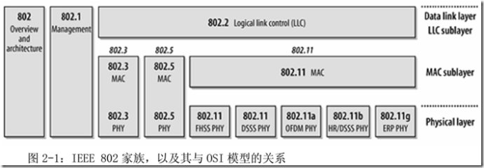
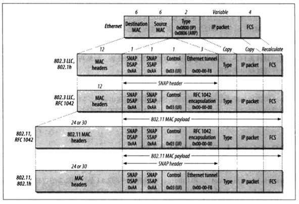
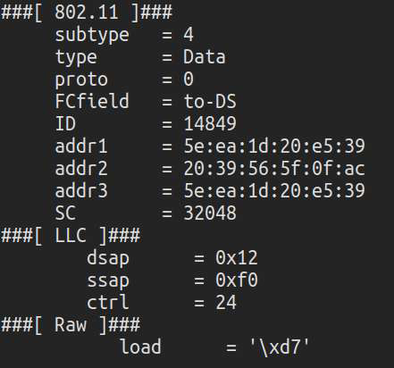

# Wireless - IEEE 802.2 LLC Sub-layer

Created by : Mr Dk.

2019 / 01 / 20 15:29

Nanjing, Jiangsu, China

---

### About

_IEEE_ 于 _1980 年 2 月_ 成立 局域网和城域网的标准化委员会

由下属各工作组负责各子标准，即 _IEEE 802_ 包含一系列子标准

_IEEE 802_ 标准定义的服务的协议位于 _OSI_ 参考模型的最低两层（数据链路层、物理层）

* _Data link layer, 数据链路层_
  * _LLC sublayer (logical link control，逻辑链路控制)_
  * _MAC sublayer (media access control, 介质访问控制)_
* _Physical layer，物理层_

可以看到：

* _802.3 Ethernet 以太网_、_802.5 Token Ring 令牌环网_ 有独立的 _MAC_ 层和物理层标准
* _802.11_ 有多个物理层标准，但有共同的 _MAC_ 层标准
* _802.3_、_802.5_、_802.11_ 共用 _802.2 LLC_ 子层
* _802_ 的网络管理功能规范于 _802.1 Management_

---

### Detail

_LLC_ 包含在 _802.11 MAC payload_ 中

_LLC_ 的头部包含：

| Fields                                                 | Length             |
| ------------------------------------------------------ | ------------------ |
| DSAP，Destination Service Access Point，目标服务接入点 | `8 bits`           |
| SSAP，Source Service Access Point，来源服务接入点      | `8 bits`           |
| Control                                                | `8` or `16` `bits` |

一个抓到的数据包：

---

### Summary

一直关注的都是 _MAC_ 子层

所以对于 _LLC_ 子层的位置和地位不太明确

---

