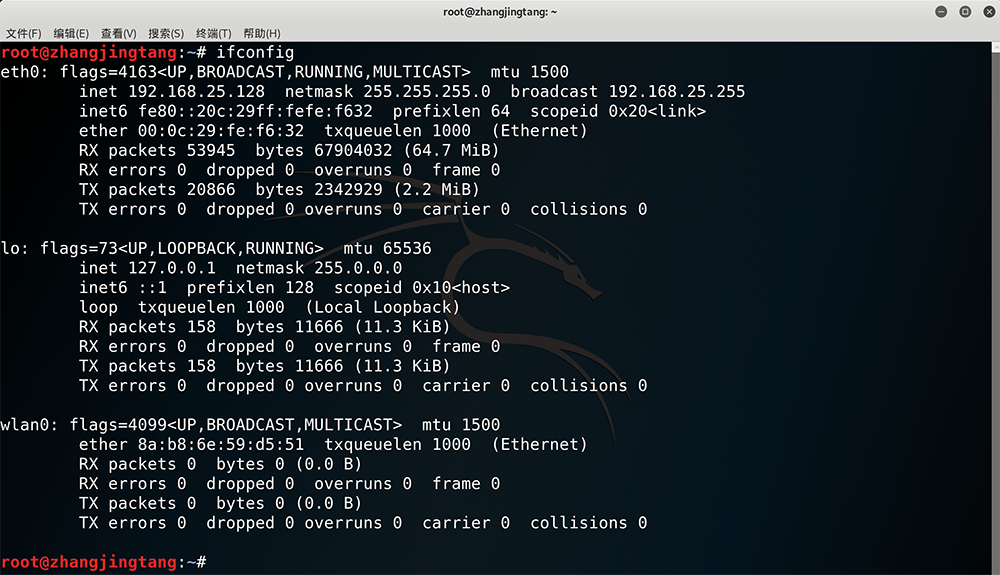
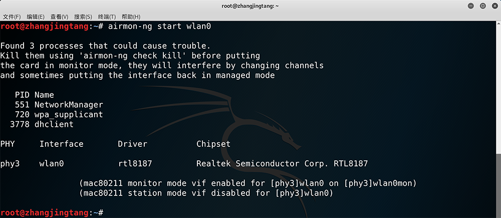
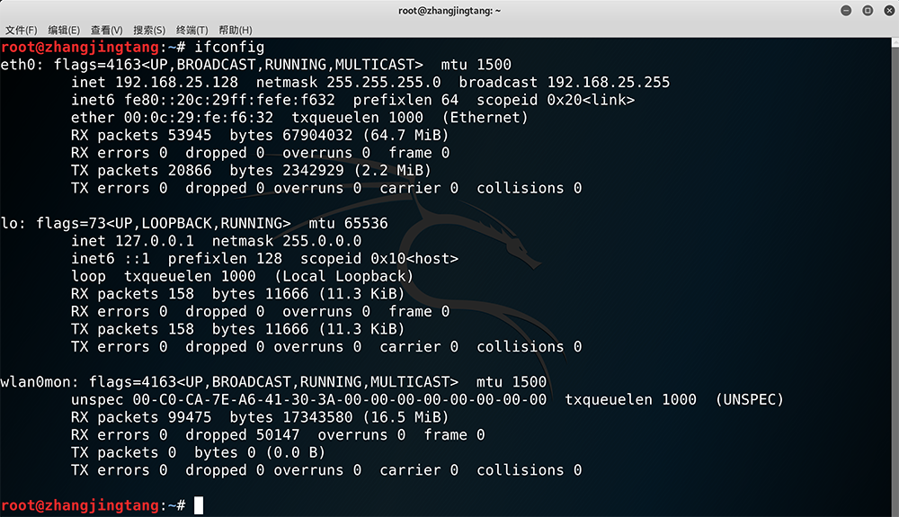
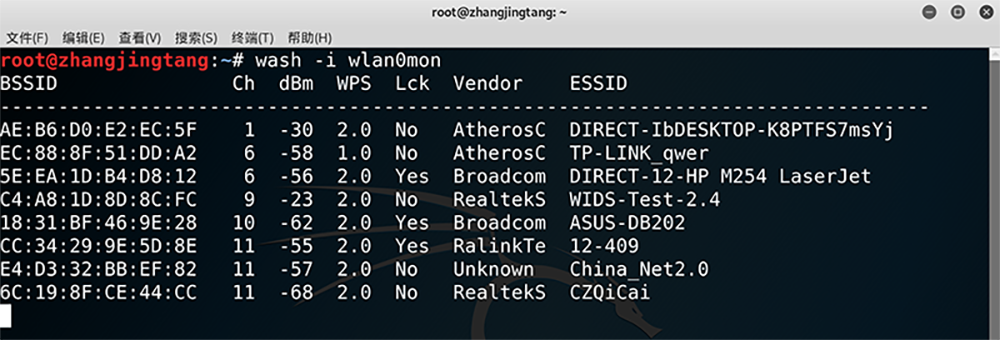
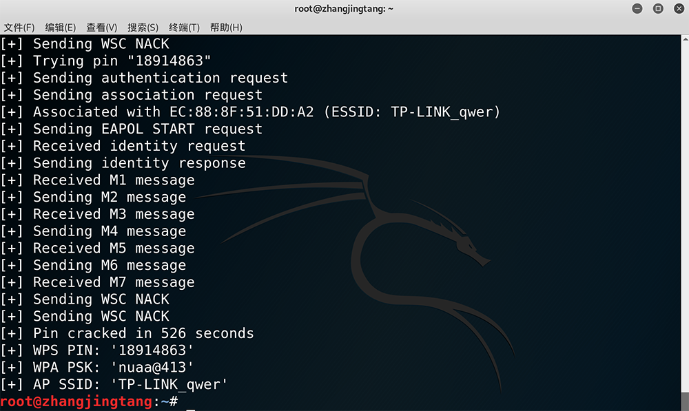

# Wireless - WPS Cracking by Reaver

Created by : Mr Dk.

2018 / 12 / 07 10:19

Nanjing, Jiangsu, China

---

## Concept

*WPS* stands for *Wi-Fi Protected Setup*. It is a wireless network security standard, created by Wi-Fi Alliance and introduced in 2006.

## Goal

WPS tries to make connections between a router and wireless devices faster and easier

- WPS works only for wireless networks that use a password encrypted with **WPA / WPA2 personal**
- WEP is not supported

## Mode

If you want to connect a wireless device to a wireless network, you need to know:

- SSID (network name)
- PSK (password of network)

Without these two elements, you can't connect to a Wi-Fi network.

What can WPS do?

1. Press the WPS on router to turn on discovery of new devices. Then, go to your device and select the network you want to connect to. The device is automatically connected to the wireless network **without entering the network password**.
2. For devices with WPS buttons. Pressing the WPS button on the router and then on those devices. You don't have to input any data during this process. WPS automatically sends the network password, and devices remember it for future use.
3. All routers with WPS enabled have a **PIN** code that is automatically generated, and it cannot be changed by users. Some devices without a WPS button but with WPS support will ask for that PIN. If you enter it, they authenticate themselves and connect to the wireless network.
4. Some devices without a WPS button but with WPS support will generate a client PIN. You can enter this PIN in router's wireless configuration panels, and the router will use it to add that device to the network.

First two ways are rapid, the last two ways do not provide any benefits regarding the time it takes to connect devices to your wireless network.

## Problem

The PIN is **insecure** and **easy to hack**:

- Eight-digit PIN is stored by routers in **two blocks of four digits** each
- The router checks the first four digits **separately** from the last four digits
- A hacker can brute-force the PIN in as little as 4 to 10 hours
- Once the PIN is brute forced, PSK is found

## Cracking Tools

- Kali Linux 中的 *reaver*
  - Reaver v1.6.5 WiFi Protected Setup Attack Tool; Copyright (c) 2011, Tactical Network Solutions, Craig Heffner
  - 用于攻击支持 WPS 的设备
- Kali Linux 中的 *wash*
  - Wash v1.6.5 WiFi Protected Setup Scan Tool; Copyright (c) 2011, Tactical Network Solutions, Craig Heffner
  - 用于扫描周围支持 WPS 的设备
- Kali Linux 中的 *aircrack-ng*：用于将网卡设定为监控模式

## Theory

支持 WPS 功能的无线路由器，只要获得它的 PIN，就可以获得它的 PSK，从而自动连入网络，简化路由器的连接配置过程。*Reaver* 通过穷举的方式暴力破解这个 PIN，从而获得无线网络的密码。

## Procedure

### Insert a USB-wireless-interface

```console
$ ifconfig
```



*wlan0* is the wireless interface I have just inserted.

### Turn the wireless-interface into monitor mode

```console
$ airmon-ng start wlan0
```



### Check whether the monitor mode is on

```console
$ ifconfig
```



*wlan0mon* is the wireless-interface which has been turned into monitor mode.

### Search for the Routers which support WPS

```console
$ wash -i wlan0mon
```



实测很多路由器已经有了保护措施：

- 不回应破解
- 穷举到一定次数后开启保护

另外和网卡放置的角度也有关系：

- 使用放在我右手边的网卡破解一直失败
- 使用放在我右手边靠窗的网卡就能破解成功

经过尝试和选择，身边唯一能被破解的网络 - `TP-LINK_qwer`。

### Start cracking by reaver

```console
$ reaver -i wlan0mon -b EC:88:8F:51:DD:A2 -vv
```

由于 8 位的 PIN 是分为两个 4 位分开存放的，*reaver* 会先穷举前四位 PIN。在我的破解过程中，在进度大约到 15% 时，突然跳到了 90%。说明前四位已被破解，直接进入了后四位的破解，因此进度大大增加。



后四位 PIN 也破解完毕。由此 8 位 PIN 已被全部破解出来，PSK 也被获得：

- AP SSID：`TP-LINK_qwer`
- PIN：`18914863`
- PSK：`nuaa@413`

如果已知路由器的 PIN，就可以直接使用 `-p PIN` 参数直接获得 PSK。

## Summary

这个破解太受条件限制了，在宿舍和实验室里找了好久，才找到这么一个唯一可以被破解的无线路由器。说明现在的路由器厂商已经非常注意防御此类破解了。令我比较郁闷的是，*kismet* 号称可以在检测到暴力破解 WPS 时发出警告，然而并没有警告啊。。。。。。

