# Wireless - wifiphisher

Created by : Mr Dk.

2019 / 01 / 11 22:52

Nanjing, Jiangsu, China

---

## About

A **Rogue Access Point** framework. [link](https://github.com/wifiphisher/wifiphisher)


_wifiphisher_ 是一款安全工具，由希腊安全研究员 _George Chatzisofroniou_ 开发。由 Python 编写，可对受害者进行定制的 **钓鱼攻击**

- 与传统的 Wi-Fi 攻击不同，不涉及任何 **handshake** 或 **brute-force**
- 利用 **社会工程学（Social Engineering）** 技术，使用一种类似欺骗的方法，使受害者在不知不觉中供出密码

  > 建立理论并通过利用自然的、社会的和制度上的途径来逐步地解决各种复杂的社会问题。

## Requirements

- Kali Linux：官方支持发布版，所有新功能都在该平台上测试
- Wireless network adapter：支持 AP & Monitor mode
- Drivers should support _netlink_

## Usages

### 1. Start wireless network adapter

```console
$ ifconfig wlan0 up
```


### 2. Turn wireless network adapter into MONITOR mode

```console
$ airmon-ng start wlan0
```

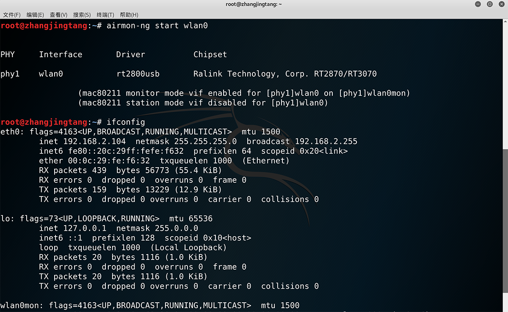

### 3. Start wifiphisher and select target

```console
$ wifiphisher
```

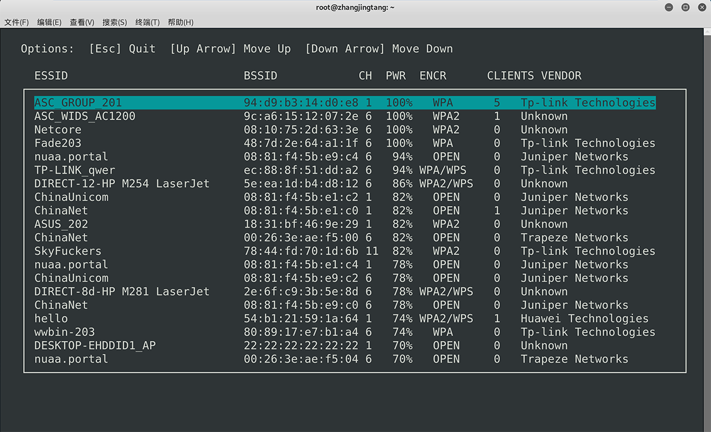

### 4. Select attacking scenarios

- Firmware Upgrade Page
- Network Manager Connect
- Browser Plugin Update
- OAuth Login Page

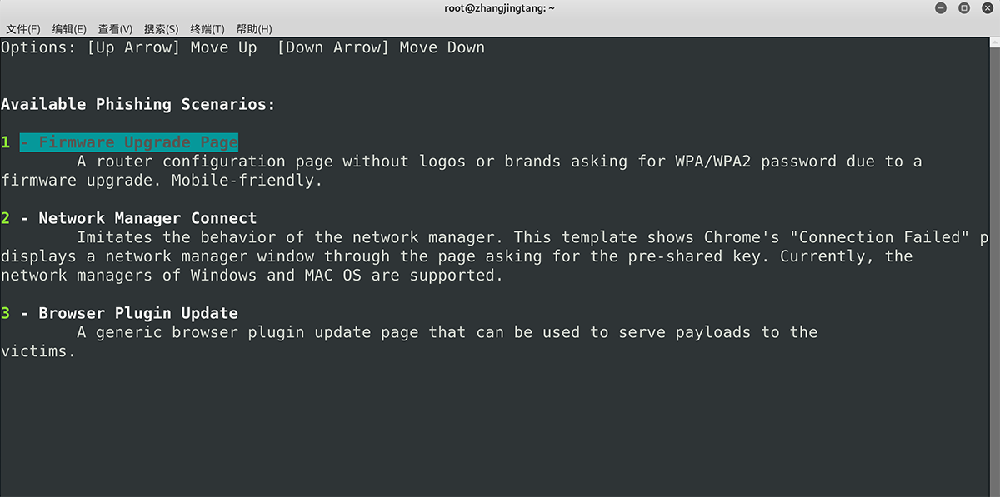

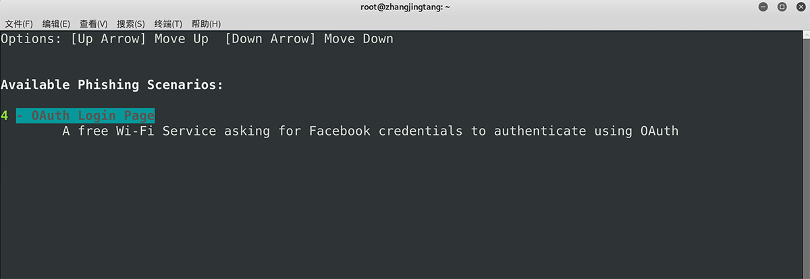

### 5. Start attacking!

- 建立一个 Evil Twin 热点
- 建立 WEB 服务，配置 DHCP 服务器
- 将所有用户请求 redirect 到高度定制化的 phishing pages

## Attacking scenarios

### Firmware Upgrade Page

伪造一个路由器固件升级界面，诱使连接上伪造 AP 的受害者输入路由器密码

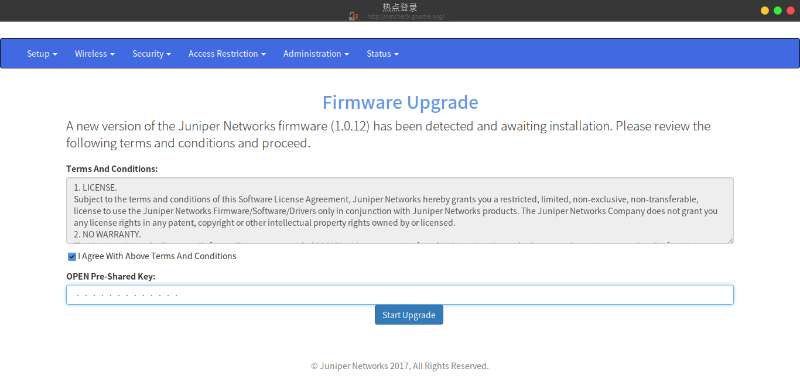

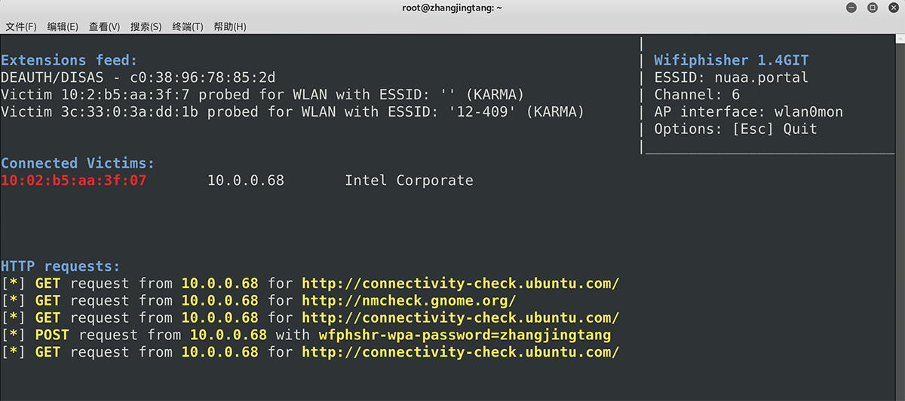

### Network Manager Connect

伪造一个网络连接失败的界面，并弹出一个重新输入网络密码的窗口，诱使受害者输入密码

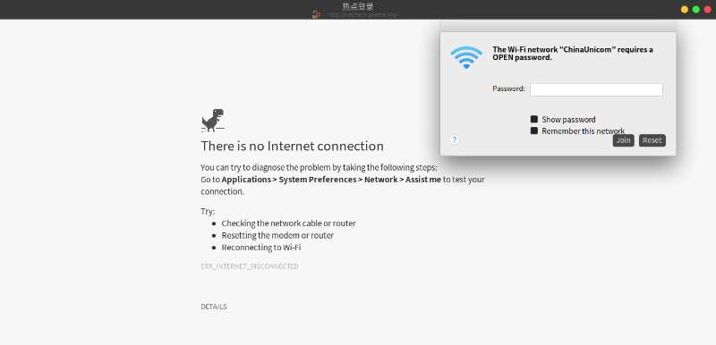

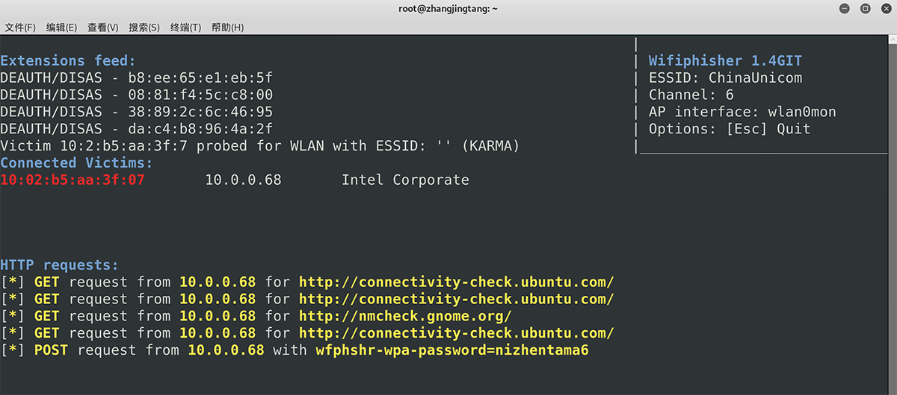

### Browser Plugin Update

伪造浏览器插件升级，让受害者下载恶意的可执行文件 - 没有尝试。

### OAuth Login Page

伪造利用社交网络账号登录的免费热点，诱使受害者输入社交网络的账号密码

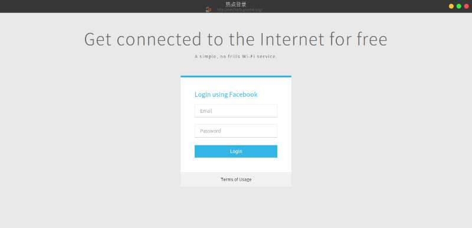

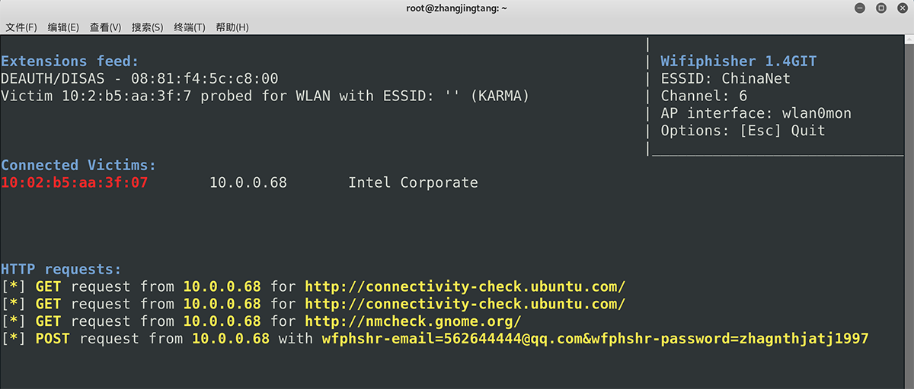

## Advanced

可自己定义更多的 phishing scenarios

- _LinkedIn_ 登录界面（与 Facebook 大同小异）
- _Adobe Flash Player_ 的升级界面，使用户下载恶意的可执行程序

可以自定义 Evil Twin AP 的 SSID 和 MAC Address

- MAC Address 的定制与网卡有关，有些网卡不支持指定 MAC Address
- 在下面的例子中
  - 伪造一个 SSID 为 `mrdk` 的 AP
  - 试图指定 MAC 地址但失败了，因此该网卡不能发动 MAC 地址相同的 Evil Twin 攻击

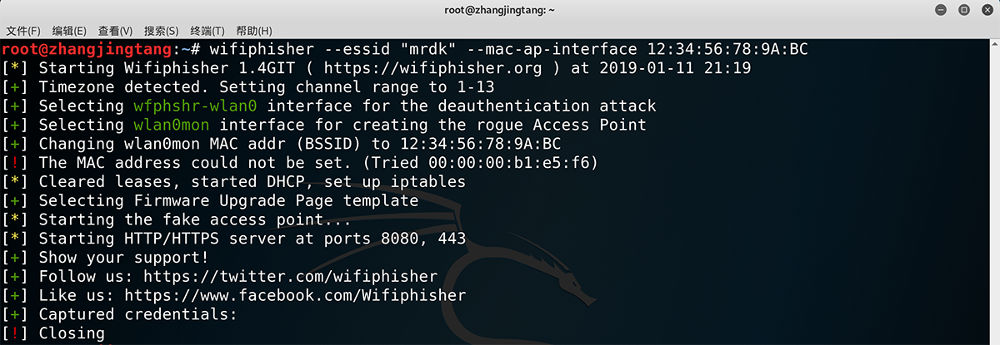


